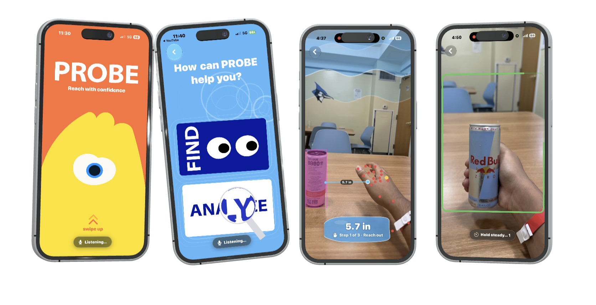

<div align="center">

# 🫳 PROBE

**Reach with confidence.**

An iOS app that helps blind and low-vision users find, grab, and identify objects, using only a phone, a voice, and a tone.




</div>

## What it does

Point the phone, tap **Find**, and Probe guides your hand to the object in three steps, then reads its label and lets you ask questions about it.

1. **Reach** to the object's depth.
2. **Move across** to it.
3. **Take hold** and bring it close enough to read.

Every step is spoken, chimed, and shown on screen. A panned tone and haptics steer the hand. Once you're holding the object, Probe reads the label and a voice agent describes it and answers questions.

## Built with

`Swift` `SwiftUI` `ARKit` `LiDAR` `Vision` `Core ML` `YOLO26n-seg` `AVFoundation` `Speech` `ElevenLabs` `LiveKit` `XcodeGen`

## Run it

Needs a physical iPhone on iOS 17+ (LiDAR recommended). The simulator has no camera.

```bash
brew install xcodegen
cd app
cp Secrets.swift.example Secrets.swift   # add your API keys (git-ignored)
xcodegen generate
open Probe.xcodeproj
```

Pick your iPhone, allow camera, microphone, and speech permissions, then run.

## Repo map

| Path | What's in it |
| --- | --- |
| `app/` | SwiftUI app and `project.yml` for XcodeGen |
| `models/` | Core ML models bundled into the app |
| `design/` | Illustrator art and the script that turns it into Swift |
| `model_trainig_code/` | EGOHOS dataset prep and YOLO training scripts |

More detail on how the app is put together lives in [`CLAUDE.md`](CLAUDE.md).
